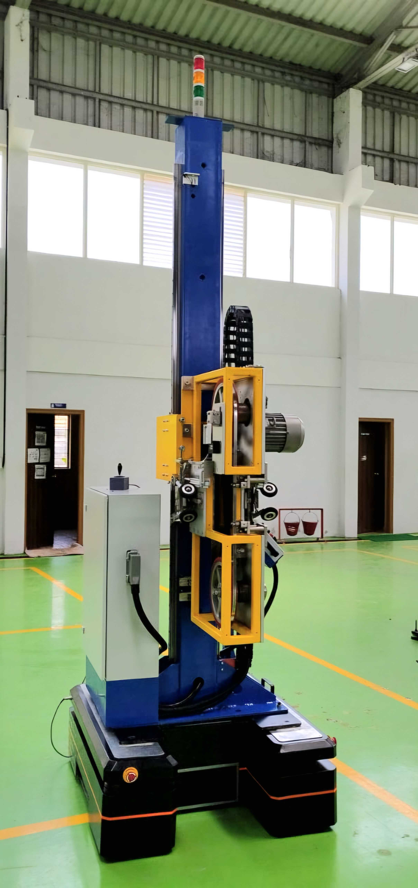

Hachidori Robotics, a 11-member tech startup founded in 2020, focused on automating material and goods movement in industrial and warehouse environments. The company's Autonomous Mobile Robots (AMRs) were designed to seamlessly integrate into dynamic environments, navigating alongside human workers to enhance material handling and workflow efficiency. 

My contributions as a R&D Robotics Engineer to the deployment of AMRs and Mobile Guided Vehicles(MGVs) are as follows,
- integration of IMU-based Kalman Filter to the autonomy stack to account for signal dropout from Local Positioning System (LPS) for autonomous indoor navigation limiting AMR's orientational drift to 1°
- production and rigorius testing of mini-satellites for deployment of LPS
- development and testing of a controller for mecanum-wheeled MGV and achieved omnidirectional mobility for cutting windill blades of arbitrary cutting radii ranging from hundreds of millimeters to tens of meters    

### Autonomous Mobile Robot

AMR positional correction for accurate picking and placing of wrehouse material despite signal dropout in LPS

### Mobile Guided Vehicle

The MGV was built for a custom application deviating from the core objective of this company being AMR development for warehouse automation. The MGV was equipped with an overhead bandsaw unit weighing about 500kg, to cut windill blades of arbitrary cutting radii ranging from hundreds of millimeters to tens of meters. The main objective was to maneuver in accordance with the shape of the distinct windmill blades retaining mm level accuracy. This was achieved by using an industrial standard joystick and mecanum wheels to maneuver the MGV to any arbitrary location.

I designed the complete software to map the movements of joystick to the MGV employing these equations. I also developed a novel algorithm that enables precise control over the MGV's curved trajectories with versatile turning radii. The algorithm calculates and maps the individual wheel speeds (RPM) to the desired turning radius based on the joystick input by adjusting the ratio of the left and right wheel speeds and dynamically shifting the robot's central axis. 

<!--  -->


360° maneuverability highlighting sideways and diagonal movements at client's shopfloor bearing 500kg payload


Testing the controller that ,aps the joystick movements to the MGV

#### Photo Gallery
