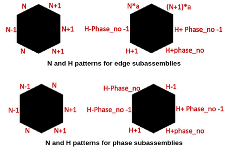
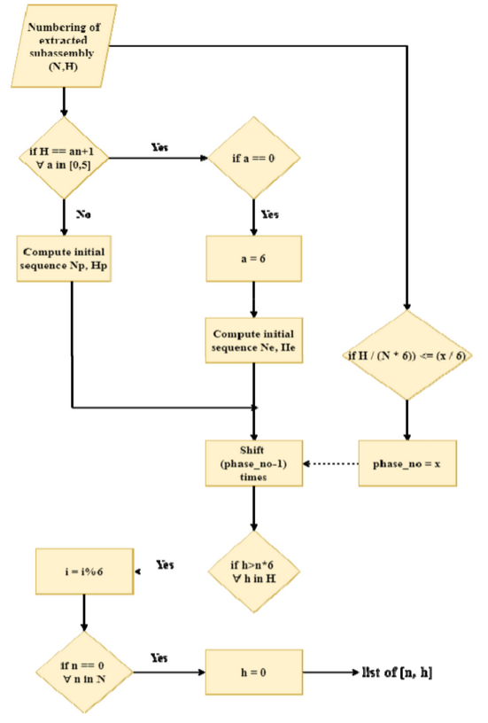

The Reactor Core Viewing System – Room Temperature (RCVS-RT) is a tool used for inspection of nucelar reactor core internals for structural deformities or foreign objects using vision probes consisting of a downward facing and two sideward facing cameras. A nuclear reactor core is of hexagonal lattice structure. Each hexagon tube is referred to as a sub-assembly. The inspection procedure involving extracting a sub-assembly and inserting the RCVS-RT. As the vision probes travels downwards, it is rotated to check for deformaties, thus giving rise to the lack of orientation awareness. In this project, this problem is resolved, achieving real-time orientational awareness by fusing data from IMU and the downward facing camera.

The subassemblies can be observed as concentric circles of hexagons. So, every subassembly is assigned a unique pair of numbers (N, H). N indicates which concentric circle the subassembly belongs to and H which subassembly it is. After innovating this unique numbering scheme, we were able to identify patterns for subassemblies present in the hexogonal phase and the edge connecting two phases. The pattern for an adjacent phase will just be shifted by one side of the hexagon.

Levergaing the observed patterns this numbering algorithm was proposed, tested with 1:1 nuclear reactor prototype and published. Given the (N, H) pair of the extracted subassembly, this algorithm displays the subassembly it is phasing in real-time with an accuracy of 1° by fusing data from the downward facing cameraand IMU connected to the onboard Raspberry Pi of the inspection system. 
