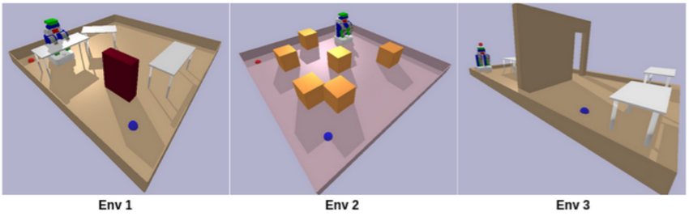
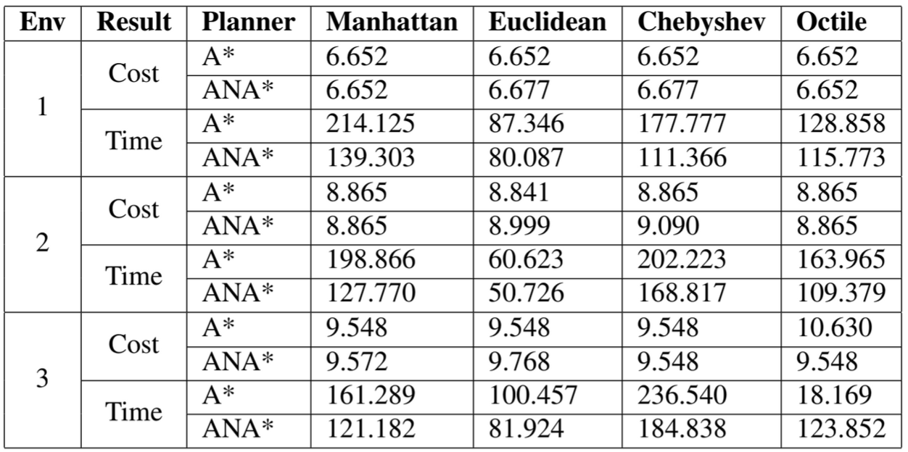
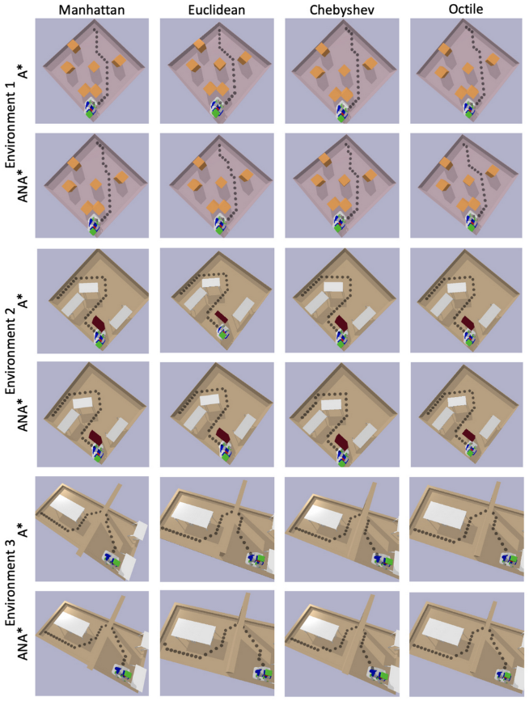

Through the Algorithmic Robotics coursework, I gained experience in implementing the algorithms that form the foundation of robot planning, state estimation, and control. This included programming robots in PyBullet simulation to perform tasks by applying optimization techniques, motion planning, representations of uncertainty, Kalman and particle filters, and point cloud processing methods. The highlights of my implementations are shown here.  

### Rapidly Exploring Random Trees (RRT)
RRT is a sampling-based path planning algorithm used to find a feasible path while navigating through a complex environment with obstacles in high dimensional spaces. The key idea is to build a tree-like structure from start to goal while sampling random neighbours in the configuration space and extending towards it while checking for obstacle collision. In this algorithm, to ensure that the goal is reached in a shorter time, the goal is sampled about 10% of the time, biasing the tree to reach the goal.
 and pruning that path (blue) for a 7DoF PR2 robot in PyBullet simulation")

### Investigating A* and ANA* across multiple heuristics
<!--  -->
A* and ANA* (Anytime Non-parametric A*) are sophisticated search algorithms widely used in AI, robotics, and optimization. They efficiently find optimal paths from a start to a goal state in a search space, considering the cost of potential paths. A* combines informed and uninformed search, making it powerful for navigating complex state spaces. Its versatility and efficiency in solving path-finding and optimization problems are key strengths. A* guarantees optimality when used with an admissible heuristic, which never overestimates the true cost to reach the goal from the current node. A heuristic function _h(n)_ is an informed estimate or function that provides a measure of the cost to reach the goal from a given state in a search space. An admissible heuristic never overestimates the true cost to reach the goal from the current node.

ANA* is nonparametric because it does not rely or make any assumptions about these ad-hoc parameters of ARA* (Anytime Repairing A*) and is anytime because it finds an initial suboptimal solution and gradually finds the optimal solution. ANA* introduces _e-score_ which ensures that everytime a suboptimal path is generated, the cost of the path is lesser than the current best solution, eventually finding the optimal path. 

The heuristics for which these algorithms were tested were Manhattan, Euclidean, Chebyshev and Octile across three different environments with static obstacles 

From the results from the table and the paths visualized in the image, it can be inferred that ANA* with Euclidean heuristic yields the lowest time despite generating suboptimal paths and with the path cost very close to the optimal cost.

### Simple Interval Path Planning (SIPP)



SIPP is another low-dimensional heuristic based algorithm that generats the best possible path for dynamic obstacles given that their velocity and heading are known. This algorithm computes the safe interval and obstacle interval for every node in the configuration space and leverages this information to compute the possible least expensive path to the goal while assuming that the inertial constraints are negligible i.e., the planner assumes the robot can stop and accelerate instantaneously.