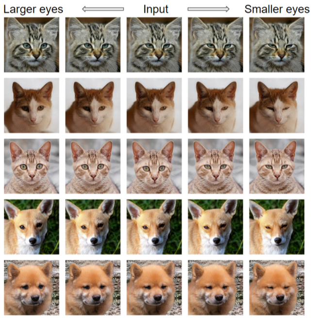

The Generative Adversarial Networks (GANs) architecture involves two sub‐models: a generator model for generating new samples and a discriminator model for classifying the generated samples as real and fake. These sub‐models are trained together in a zero‐sum game manner, thus adversarial in nature. The generator takes a random vector with a fixed length as input and generates a sample. This generated sample vector is referred to as latent code, and the space of vectors is referred to as latent space. In essence, the generator model learns the mapping from the latent space to the image space of the dataset, for training the GANs. Conventional methodw perform this mapping mechanism but cannot locally edit the regions of interest (RoI), in other words didn't find semantically meaningful directions. A meaningful semantic direction in the latent code is a direction in the latent space that corresponds to a meaningful change in the generated images for targeted RoI.

The following claims of the author were verified during reimplementation,
- ReSeFa doesn’t require detailed spatial masks. A rough bounding box is sufficient to define the region of interest.
- The process of finding latent directions using ReSeFa focuses on solving an eigen‐decomposition problem, gaining independence from model structures.
- ReSeFa induces flexibility as it can be generalized to various GAN models.
- ReSeFa realizes quick implementation and precise editing of regions of interest.
 
ReSeFa uses the StyleGAN2 model pre‐trained on the Flickr‐Faces‐HQ (FFHQ) dataset to produce high‐resolution images. Besides, we also use the StyleGAN3 pre‐trained on the Animal Faces‐HQ (AFHQ) dataset. The degree of editing &alpha; is the hyperparameter that influences the manipulated image generation process. As stated above, we intend to find the latent direction <em>n</em> &in; &Zopf; in such a way that altering a latent code <em>z</em> through the direction can cause the corresponding semantic change in the manipulated image <em>x</em>.

<code>edit(x) &#x25b3; xedit = G(z + &alpha; n)</code>

The coordinates of the RoI and the indices of the feature layers chosen to manipulate from hierarchical feature layers are the hyperparameters that influence the direction discovery process.

### Reproduced qualitative results
In the featured image at the top, the comparison of precise local editing results produced in the original paper and our reimplementation of the original paper can be seen. The RoI is highlighted in green boxes where all the rows share the same latent directions. It can observed that RoI are locally edited with precision retaining other parts of the image, in other words, meaning semantic directions were found to ocally edit only the RoI.

### Extended qualitative results

<!--  -->

<!-- 
360° maneuverability highlighting sideways and diagonal movements at client's shopfloor bearing 500kg payload -->

<!-- #### Photo Gallery
 -->