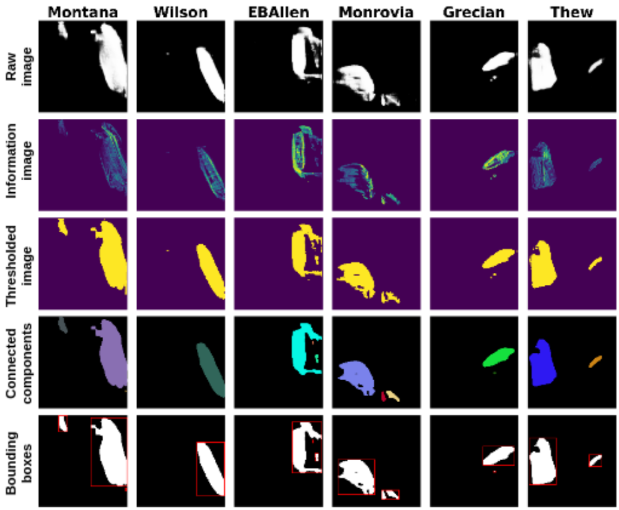
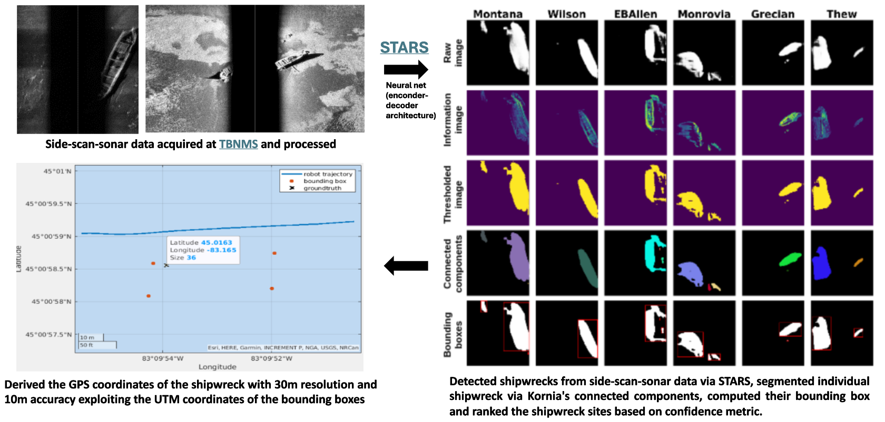
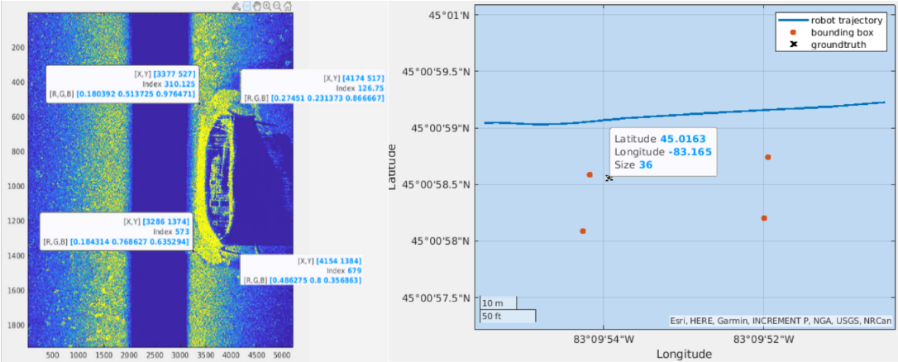
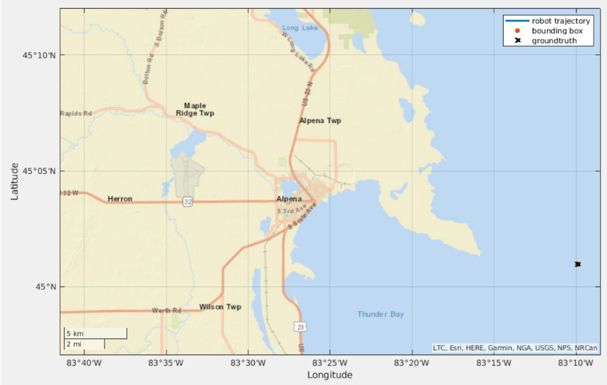
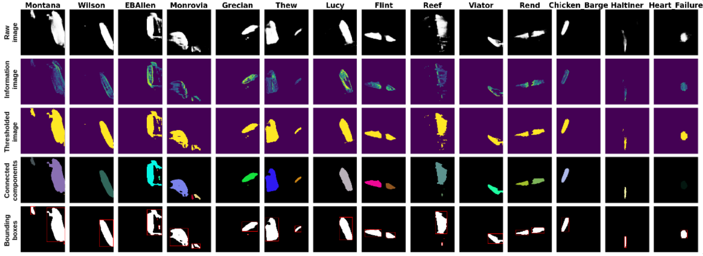

Exploring underwater areas of archaeological importance is a multi-step pipeline that requires expensive resources. To begin with, a specific area is chosen considering the probability that it contains valuable sites and the risks of them being damaged (e.g. dredging, pipeline construction, and fishing installation). This is followed by a high-altitude survey using Side Scan Sonar (SSS), either deployed with a tow fish or an Autonomous Underwater Vehicles (AUVs). Subsequently, technical personnel evaluates the images produced to find and rank potential sites. This is essential as there are not usually enough resources or time to explore all the identified sites. These sites are revisited to accurately decide their worth, which is typically done with human divers or Remotely Operated Vehicles (ROVs).

In this project, shipwrecks were detected leveraging [STARS](https://arxiv.org/abs/2310.01667), GPS coordinates of the detetced shipwrecks were derived and the multiple shipwreck sites were ranked of archeaological importance. This pipeline in employed by the [Thunder Bay National Marine Sanctuary](https://thunderbay.noaa.gov/) for underwater explaoration and shipwreck analysis. My contributions to this are as follows,
- reproduction of neural network architecture of the semantic segmentation baselines [Burguera](https://www.mdpi.com/2077-1312/8/8/557#) and [Yang et al](https://www.frontiersin.org/articles/10.3389/fnbot.2022.928206/full) for detection of shipwrecks
- deriving GPS coordinates of the shipwrecks with 30m resolution and 10m accuracy from the output of STARS
- formulating a confidence score-based metric to rank the shipwreck sites

<!-- ## Results -->
<!--  -->
<!--  -->
### GPS coordinates derivation
The output of STARS were segmentation masks with detected shipwrecks. For each shipwreck site, the appropriate threshold intensity was determined from which thresholded segmentation masks were obtained. [Kornia's connected components](https://kornia.github.io/tutorials/nbs/connected_components.html) were used to determine the bounding boxes around the shipwrecks. The frequncy SSS is higher than the GPS present in the deployed AUV to gather shipwreck data at Lake Huron, Michigan. Finally, utilizing the periodic and discontinuous UTM coordinates and the pixel values from the thresholded segmentation masks with bouding boxes, the AUV's trajectory was interpolated and the GPS coordinates of the shipwrecks were derived with 10m accuracy and 30m resolution.  

From this result, it can seen that the detected bounding box of ship matches the groundtruth GPS location. In the following image, a zoomed out view of the map can be seen. 

### Confidence-score ranking metric
The ranking was based on _confidence-score_ as the objective was to determine the site with artifacts of most archeaological importance. Thus, the mean of pixel intensities of the thresholded segmentation values were computed for every image across a shipwreck site. The images with the highest mean are displayed in the result and the shipwrecks are displayed according to their rank. 

The rows of the result indicate raw segmentation mask from STARS, their original intensity values, the thresholded images determining the boundary of the shipwrecks, the result of connected components and the bounding boxes. 
<!-- A detailed report can be viewed [here](https://drive.google.com/file/d/1Zjk1kY0urg-n3OiZrIOU0J4ylqPFSzRa/view?usp=sharing). -->