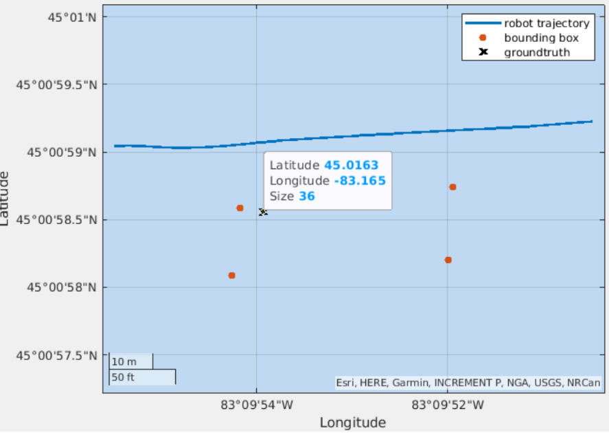

Exploring underwater areas of archaeological importance is a multi-step pipeline that requires expensive resources. To begin with, a specific area is chosen considering the probability that it contains valuable sites and the risks of them being damaged (e.g. dredging, pipeline construction, and fishing installation). This is followed by a high-altitude survey using Side Scan Sonar (SSS), either deployed with a tow fish or an Autonomous Underwater Vehicles (AUVs). Subsequently, technical personnel evaluates the images produced to find and rank potential sites. This is essential as there are not usually enough resources or time to explore all the identified sites. These sites are revisited to accurately decide their worth, which is typically done with human divers or Remotely Operated Vehicles (ROVs).

In this project, shipwrecks were detected leveraging [STARS](https://arxiv.org/abs/2310.01667), GPS coordinates of the detetced shipwrecks were derived and the multiple shipwreck sites were ranked of archeaological importance. This pipeline in employed by the Thunder Bay National Marine Sanctuary for underwater explaoration and shipwreck analysis. My contributions to this are as follows,
- reproduction of semantic segmentation baselines [Burguera](https://www.mdpi.com/2077-1312/8/8/557#) and [Yang et al](https://www.frontiersin.org/articles/10.3389/fnbot.2022.928206/full) for detection of shipwrecks
- deriving GPS coordinates of the shipwrecks with 30m resolution and 10m accuracy from the output of STARS
- formulating a confidence score-based metric to rank the shipwreck sites

<!-- ## Results

 -->
