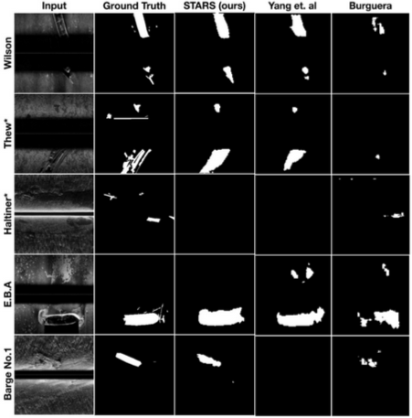
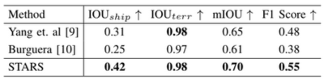

[UMich Field Robotics Group](https://fieldrobotics.engin.umich.edu/) is a research lab that focuses on underwater and space robotics with a focus on enabling autonomy in a dynamic and unstructured environment. One of my projects in this lab was to accurately derive the GPS coordinates of the detected shipwrecks from multiple shipwreck sites in the  [Thunder Bay National Marine Sanctuary](https://thunderbay.noaa.gov/) (TBNMS), Lake Huron, MI. 

Underwater archaeological exploration is a complex and resource-intensive process that relies heavily on tools like Side Scan Sonar (SSS) to map the seafloor and identify potential sites of interest, such as shipwrecks. Traditional approaches often involve manual evaluation of sonar images, which can be time-consuming and costly, especially for deepwater sites inaccessible to human divers. To address these challenges, this project introduces an automated pipeline [Shipwreck AI](https://youtu.be/UtNK1Ite8no?si=VKX90Tq1wsh7mmM7) which detects the shipwrecks, derive their GPS coordinates and rank the multiple sites of archeaological importance. The results were sucessfully demonstrated to [TBNMS, NOAA](https://thunderbay.noaa.gov/).  

My contributions include,
- reproduction of neural network architecture of the semantic segmentation baselines [Burguera](https://www.mdpi.com/2077-1312/8/8/557#) and [Yang et al](https://www.frontiersin.org/articles/10.3389/fnbot.2022.928206/full) for detection of shipwrecks
- derivation of GPS coordinates of the shipwrecks with 30m resolution and 10m accuracy
- formulation a confidence score-based metric to rank the shipwreck sites

#### A glimpse of side-scan-sonar dataset


### Reproduction of segmentation models

### GPS coordinates derivation
The output of STARS were segmentation masks with detected shipwrecks. For each shipwreck site, the appropriate threshold intensity was determined from which thresholded segmentation masks were obtained. [Kornia's connected components](https://kornia.github.io/tutorials/nbs/connected_components.html) were used to determine the bounding boxes around the shipwrecks. The frequncy SSS is higher than the GPS present in the deployed AUV to gather shipwreck data at Lake Huron, Michigan. Finally, utilizing the periodic and discontinuous UTM coordinates and the pixel values from the thresholded segmentation masks with bouding boxes, the AUV's trajectory was interpolated and the GPS coordinates of the shipwrecks were derived with 10m accuracy and 30m resolution.  

From this result, it can seen that the detected bounding box of ship matches the groundtruth GPS location. In the following image, a zoomed out view of the map can be seen. 

### Confidence-score ranking metric
The ranking was based on _confidence-score_ as the objective was to determine the site with artifacts of most archeaological importance. Thus, the mean of pixel intensities of the thresholded segmentation values were computed for every image across a shipwreck site. The images with the highest mean are displayed in the result and the shipwrecks are displayed according to their rank. 

The rows of the result indicate raw segmentation mask from STARS, their original intensity values, the thresholded images determining the boundary of the shipwrecks, the result of connected components and the bounding boxes. 
<!-- A detailed report can be viewed [here](https://drive.google.com/file/d/1Zjk1kY0urg-n3OiZrIOU0J4ylqPFSzRa/view?usp=sharing). -->