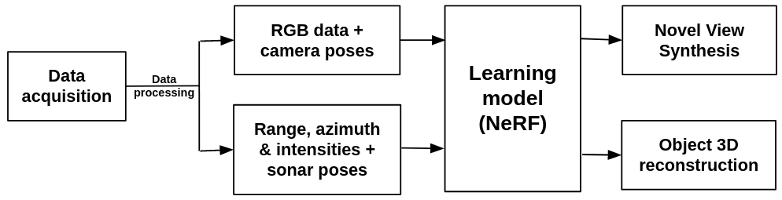

Underwater imaging refers to the process of capturing visual images or videos in an underwater environment. Underwater imaging is a critical task performed by marine robots for a wide range of applications including aquaculture, marine infrastructure inspection, coral reef supervision, and archaeological artifacts exploration. Improving underwater perception will advance autonomous capabilities of underwater vehicles, enabling increased complexity of their missions. Extending underwater imaging to underwater 3D reconstruction benefits with improved spatial accuracy conveying depth perception, enables quantitative analysis of underwater structures, among many others.

The key elements required for a dense 3D reconstruction are the depth, RGB images, and their corresponding camera poses. While optical cameras yield visibility and can be used to gather features such as color or texture, they are prone to be affected by attenuation, refraction, lack of illumination, light scattering, light absorption, and sunlight scintillation in shallow waters. Due to these factors, it is highly challenging to achieve dense 3D reconstruction in the underwater medium. Acoustic sensors have been used to improve the performance of visual odometry and scene reconstruction for underwater scenarios in recent years despite having lower resolutions. Acoustic sonars are more robust to the impediments faced by optical cameras but do not provide color information. Since both sensing modalities complement each other, they are fused to build an efficient underwater multimodal vision system, improving underwater imaging.

A recent state-of-the-art representation of 3D surfaces which leverages on the deployment of a Multi-Layer Perceptron (MLP) to fit a continuous function that implicitly represents a signal of interest is referred to as the Neural Implicit Representations. Thus, the objective of this project is to 3D reconstruct underwater objects using both monocular camera and multi-beam imaging sonar data employing state-of-the-art data-driven learning model representing the object surface as Neural Implicit functions, in this case Neural Radiance Fields ([NeRF](https://arxiv.org/abs/2003.08934)) based learning model.

My contributions to this are as follows,
- development of ROS-based sensor driver for [Ping360 scanning imaging sonar](https://bluerobotics.com/store/sonars/imaging-sonars/ping360-sonar-r1-rp/) and [Oculus multibeam imaging sonar](https://www.blueprintsubsea.com/downloads/oculus/UM-148-P01222-05.pdf) for real-world data acquisition
- development of ROS-based real-time custom visualizer for the Ping360 sonar
- time synchronization of sonar and monocular camera data levergaing their closest timestamps
- processed sonar data into a format readable by the learning models
- formulated an optimization problem to derive the transformation matrix between the sonar and camera for extrinsic calibration of sensors
- reproduced and extended [Neusis](https://rpl.ri.cmu.edu/neusis/) for enhanced learning of the implicit surface by reducing noise and eliminating outliers.
- reproduced [SeaThru-NeRF](https://sea-thru-nerf.github.io/) and tested it with custom RGB dataset.

### Ping360 visualizer

### Optimization formulation for sonar pose generation
Any NeRF-based architecture requires RBG information and camera poses. As we intend to utilize multi-modal data, we require sonar data along with sonar poses. COLMAP is a general-purpose Structure-from-Motion and Multi-View Stereo pipeline with a graphical and command-line interface. It is intended for RGB input and cannot take in sonar data to output sonar poses. So, I present an optimization problem that requires sonar data Ds consisting of range and intensities (r, &theta;), 3D points x = (Xc, Yc, Zc) sampled by the camera and camera poses Pc as input and produces the transformation matrix from camera to sonar, Tsc along with a scaling factor, &alpha;. Pre-multiplying this transformation matrix with the camera poses produces sonar poses assuming that the sonar sampled the same 3D points as the camera. Thus, the formulated optimization problem is,

where K is the camera intrinsics, Dw is the 3D points sampled from the world frame, Ds is the same world points sampled from the sonar frame, Tcw is a homogeneous transformation matrix cenverting 3D points from world frame to camera frame, Psc is the projection of camera into sonar, which is given by coordinate to polar frame transformations.

### Reproduction and extension of [Neusis](https://rpl.ri.cmu.edu/neusis/)
Neusis was reproduced using HoloOcean simulated dataset provided by the authors. The reproduced classes are 14° planeFull, 14° planeMissing, 14° submarine, 28° planeFull and 28° planeMissing respectively where the angle denotes the elevation aperture of the sonars they used.

#### Truncated Signed Distance Function (TSDF)
The extension centers on the optimization of the existing Neusis network by replacing the Signed Distance Function (SDF) with [TSDF](https://link.springer.com/content/pdf/10.1007/978-3-319-11755-3_40.pdf). SDF represents a 3D object as a continuous function in space. SDF returns the signed distance from any point in space to the surface of the object (primitive). The output value of this function is always a floating-point number that can have three different meanings depending on the context.
- Zero: the point is located precisely on the surface of the primitive being rendered.
- Negative: the point is inside the primitive and smaller values indicates deeper points.
- Positive: the point is outside the primitive and larger values mean it is farther away from the primitive.

When SDF is truncated at _±t_, large distances are not relevant for surface reconstruction and a restriction at the range of the values can be utilized to reduce memory footprint. In the codebase, _truncation_distance_ variable was introduces and hypertuned to value 0.23 units. The following formulation was designed implemented in the code base.

where _tsdfi_  is the truncated signed distance of the _ith_ pixel, _dt_ is the truncated distance and _ds_ is the signed distance. The concept is to conveniently use _dt_ and _ds_ depending on the situation.

