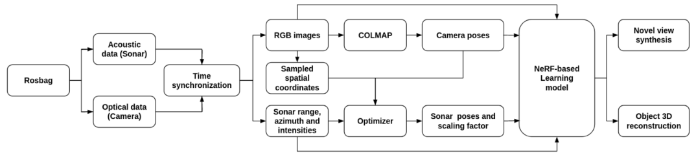

### Significance of underwater imaging in robotics
Underwater imaging refers to the process of capturing visual images or videos in an underwater environment. Underwater imaging is a critical task performed by marine robots for a wide range of applications including aquaculture, marine infrastructure inspection, coral reef supervision, and archaeological artifact exploration. Improving underwater perception will advance the autonomous capabilities of underwater vehicles, enabling increased mission complexity and precision in tasks such as inspection and exploration. 

### Evolving to underwater 3D reconstruction
Extending underwater imaging to 3D reconstruction offers several benefits. It enhances spatial accuracy and improves depth perception. Additionally, it enables quantitative analysis of underwater structures, providing a more comprehensive understanding of the subaquatic environment.

### Challenges in underwater 3D reconstruction 
<!-- The key elements required for dense 3D reconstruction are depth, RGB images, and their corresponding camera poses. While optical cameras yield visibility and capture features such as color and texture, they are prone to attenuation, refraction, light scattering, absorption, and sunlight scintillation in shallow waters. Due to these factors, achieving dense 3D reconstruction underwater is highly challenging.  -->
Dense 3D reconstruction requires three key elements: depth information, RGB images, and corresponding camera poses. However, underwater environments pose unique challenges for optical cameras. These challenges include attenuation, refraction, light scattering, and absorption. In shallow waters, sunlight scintillation further complicates imaging. These factors make achieving dense 3D reconstruction using exisiting state-of-the-art camera-based optical models for underwater highly challenging.

### Sensor fusion: A solution to underwater imaging challenges
Acoustic sensors, like sonars, have been increasingly used to complement visual odometry and scene reconstruction in underwater environments, offering robustness to the limitations of optical cameras, albeit at lower resolutions. Since acoustic sonars do not provide color information but can overcome visual distortions, the two sensing modalities—optical and sonar—are fused to build a robust, multimodal underwater vision system, enhancing underwater imaging.

### Leveraging Neural Implicit Representations for 3D reconstructions
A recent state-of-the-art method for representing 3D surfaces involves using a Multi-Layer Perceptron (MLP) to fit a continuous function that implicitly represents the signal of interest, referred to as Neural Implicit Representations. This project aims to address the challenge of underwater 3D reconstruction by utilizing both monocular camera and multi-beam sonar data within this framework. Specifically, the project employs a Neural Radiance Fields ([NeRF](https://arxiv.org/abs/2003.08934))-based deep learning models to represent the object’s surface. NeRF's ability to model continuous 3D surfaces with high accuracy makes it well-suited for handling the complexities of underwater environments, providing a promising solution for reconstructing underwater objects with enhanced precision.

<!-- A recent state-of-the-art representation of 3D surfaces which leverages on the deployment of a Multi-Layer Perceptron (MLP) to fit a continuous function that implicitly represents a signal of interest is referred to as the Neural Implicit Representations. Thus, the objective of this project is to 3D reconstruct underwater objects using both monocular camera and multi-beam imaging sonar data employing state-of-the-art data-driven learning model representing the object surface as Neural Implicit functions, in this case Neural Radiance Fields ([NeRF](https://arxiv.org/abs/2003.08934)) based learning model. -->

### Technical approach

For this grand problem of 3D reconstructing underwater environments while fusing RCB data and multibeam sonar data, I set up the foundation during my time at the [FRoG lab](https://fieldrobotics.engin.umich.edu/home). My contributions to this are as follows,
- development of ROS-based sensor driver for [Ping360 scanning imaging sonar](https://bluerobotics.com/store/sonars/imaging-sonars/ping360-sonar-r1-rp/) and [Oculus multibeam imaging sonar](https://www.blueprintsubsea.com/downloads/oculus/UM-148-P01222-05.pdf) facilitating real-world data acquisition
- development of ROS-based real-time data collection visualizer for the Ping360 sonar, enabling real-time supervision during data collection
- time synchronization of sonar and monocular camera data levergaing their closest timestamps ensuring accurate data fusion
- development of data processing techniques to convert sonar data into a format compatible with baseline learning models, bridging the gap between raw sensor data and deep learning models
- derivation of the transformation matrix between the sonar and camera for extrinsic calibration of the sensors and sonar pose generation through formulatind and solving a non-linear optimization problem
- reproduced and tweaked [Neusis](https://rpl.ri.cmu.edu/neusis/) for faster learning of the implicit surface while reducing noise and eliminating outliers with simulated data.
- reproduction of testing [SeaThru-NeRF](https://sea-thru-nerf.github.io/) with acquired RGB dataset.

### Data acquistion

The BlueROV robot was manually controlled using a joystick to navigate toward a coral reef-like object placed at the bottom of the towing tank in the [Marine Hydrodynamics Lab](https://mhl.engin.umich.edu/) (MHL). Once the object is clearly visible, the data recording rosbags were instantiated to captured multiple images of the object from various angles, fully rotating around it to facilitate a 3D reconstruction of the underwater object. The coral was also placed with a color checker, imitating the Panama dataset provided by the SeaThru-NeRF authors.

#### Ping360 visualizer

### Sonar pose generation via non-linear oprimization
Any NeRF-based architecture requires RBG information and camera poses. As we intend to utilize multi-modal data, we had to derive the sonar poses. The camera poses were derived using [COLAMP](https://colmap.github.io/), a general-purpose Structure-from-Motion and Multi-View Stereo pipeline given the RGB data. 

A non-linear optimization problem was formulated and solved to derive the sonar poses given the sonar data, RGB data and the derived camera poses. This requires sonar data Ds consisting of range and intensities (r, &theta;), 3D points x = (Xc, Yc, Zc) sampled by the camera and camera poses Pc as input and produces the transformation matrix from camera to sonar, Tsc along with a scaling factor, &alpha;. Pre-multiplying this transformation matrix with the camera poses produces sonar poses assuming that the sonar sampled the same 3D points as the camera. Thus, the formulated optimization problem is,

where K is the camera intrinsics, Dw is the 3D points sampled from the world frame, Ds is the same world points sampled from the sonar frame, Tcw is a homogeneous transformation matrix cenverting 3D points from world frame to camera frame, Psc is the projection of camera into sonar, which is given by coordinate to polar frame transformations.

### Reproduction of [SeaThru-NeRF](https://sea-thru-nerf.github.io/) on custom dataset
As a step towards testing our real-world data on exisitng models, SeaThru-NeRF was reproduced as it was developed for rendering photorealistic novel-views while accounting for the medium that strongly  influences the appearance of objects like foggy scenes or underwater data. While the resuts were not accurate, it led to potential investigations to mitigate the problem.
 and MHL (acquired) datasets") 

Upon observation, I suspect this might be due to the fact that backscaterring is not detected in the custom dataset. Despite choosing a coral reef with distinct features, the minimal variation between the consecutive frames of the input data seems to result in poor learning of the medium parameters. Despite training the model with different learning rate and batch size (as instructed by the authors), this was the best batch of results with training time of six hours. 

### [Neusis](https://rpl.ri.cmu.edu/neusis/)
Another baselinne chosen to be compared against was Neusis since the authors used MLPs to 3D reconstruct underwater objects using imaging sonar data. Neusis was reproduced using HoloOcean simulated dataset provided by the authors. The reproduced classes are 14° planeFull, 14° planeMissing, 14° submarine, 28° planeFull and 28° planeMissing respectively where the angle denotes the elevation aperture of the sonars they used.

#### Truncated Signed Distance Function (TSDF)
The models was experimented wiwth to increase the learning rate by replacing the Signed Distance Function (SDF) with [TSDF](https://link.springer.com/content/pdf/10.1007/978-3-319-11755-3_40.pdf). SDF represents a 3D object as a continuous function in space. SDF returns the signed distance from any point in space to the surface of the object (primitive). The output value of this function is always a floating-point number that can have three different meanings depending on the context.
- Zero: the point is located precisely on the surface of the primitive being rendered.
- Negative: the point is inside the primitive and smaller values indicates deeper points.
- Positive: the point is outside the primitive and larger values mean it is farther away from the primitive.

When SDF is truncated at _±t_, large distances are not relevant for surface reconstruction and a restriction at the range of the values can be utilized to reduce memory footprint. In the codebase, _truncation_distance_ variable was introduces and hypertuned to value 0.23 units. The following formulation was designed implemented in the code base.

where _tsdfi_  is the truncated signed distance of the _ith_ pixel, _dt_ is the truncated distance and _ds_ is the signed distance. The concept is to conveniently use _dt_ and _ds_ depending on the situation.

Unfortunately, I had to leave the lab upon graduating before the integration of quantitative metrics into the Neusis codebase and testing this model on acquired data.

### Conclusion
During my time at the FRoG Lab, I believe I made significant contributions to establishing a foundation for tackling the underwater 3D reconstruction problem on multiple fronts and outlined a clear roadmap for the next steps in the project.