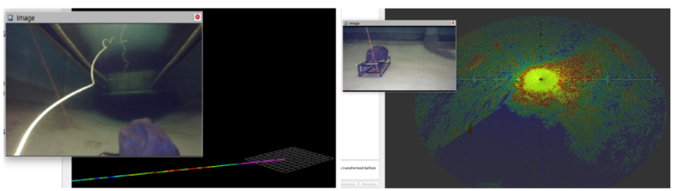

[UMich Field Robotics Group](https://fieldrobotics.engin.umich.edu/) is a research lab that focuses on underwater and space robotics with a focus on enabling autonomy in a dynamic and unstructured environment. One of my projects in this lab was to contribute to the grand challenge of 3D reconstruction of underwater environment. 

Underwater imaging and 3D reconstruction are crucial for marine robotics applications like aquaculture, infrastructure inspection, and archaeological exploration. While traditional optical cameras face significant challenges underwater (including attenuation, refraction, and light scattering), the integration of acoustic sensors like sonar provides complementary capabilities. Using these sensing modalities with cutting-edge 3D reconstruction learning models with novel-view synthesis like [Neural Radiance Fields](https://arxiv.org/abs/2003.08934) (NeRF) was the objective of this project. 

### Technical approach

A detailed process overview of underwater 3D reconstruction involving acquiring real-world data, synching multi-modal data, obtaining the poses of the camera and the sonar to pass them through a novel NeRF-based learning model to obtain the novel-view synthesis and underwater 3D reconstruction. My controbutions to this pipeline are,
- building C++ and python ROS-based driver for [Ping360](https://bluerobotics.com/store/sonars/imaging-sonars/ping360-sonar-r1-rp/) and [Oculus](https://www.blueprintsubsea.com/oculus/oculus-m-series) sonars
- developing data visualizers for sonar data
- collecting multi-modal data at the [Marine Hydrodynamics Lab](https://mhl.engin.umich.edu/)
- synchronising data from sonar and monocular camera
- deriving the realtive pose between sonar and camera through non-linear optimization
- deriving sonar poses and depth scaling factor for 3D reconstruction learning models 
- processing and testing the custom data against state-of-the-art 3D reconstruction model, [SeaThru-NeRF](https://sea-thru-nerf.github.io/)
- reproduced and tweaked [Neusis](https://rpl.ri.cmu.edu/neusis/) for faster learning of the implicit surface while reducing noise and eliminating outliers with simulated data.

### Data acquistion

The BlueROV robot was manually controlled using a joystick to navigate toward a coral reef-like object placed at the bottom of the towing tank in the [Marine Hydrodynamics Lab](https://mhl.engin.umich.edu/) (MHL). Once the object is clearly visible, the data recording rosbags were instantiated to captured multiple images of the object from various angles, hovering around the object to facilitate a 3D reconstruction of the underwater object. The coral was also placed with a color checker, imitating the Panama dataset provided by the SeaThru-NeRF authors.

#### Ping360 visualizer

<!-- #### A glimpse at the coral-reef dataset
 -->
<!-- /workspaces/niba.github.io/assets/media/albums/uw3D -->

### Data processing
Post data collection, as it can be seen in the technical overview, the multi-modal data was synced based on their closest timestanps. The sonar range, azimuth and intensities and the RGB images were extracted from the dataset for further steps.  

### COLMAP
NeRF-based architectures were built upon pinhole camera model and requires RBG information along with camera poses. The camera poses were derived using [COLAMP](https://colmap.github.io/), a general-purpose Structure-from-Motion and Multi-View Stereo pipeline which requires RGB data as input. 

### Non-linear optimizer
Now that we have, camera data, camera poses and sonar data, we formulated and solved a non-linear optimization problem to derive the relative pose between the sonar and camera to generate sonar poses for the NeRF-based learning model. The sonar data Ds consisting of range and intensities (r, &theta;), 3D points x = (Xc, Yc, Zc) sampled by the camera and camera poses Pc were the inputs to produce the transformation matrix from camera to sonar, Tsc along with a scaling factor, &alpha;. Pre-multiplying this transformation matrix with the camera poses produces sonar poses assuming that the sonar sampled the same 3D points as the camera. Thus, the formulated optimization problem is,

where K is the camera intrinsics, Dw is the 3D points sampled from the world frame, Ds is the same world points sampled from the sonar frame, Tcw is a homogeneous transformation matrix cenverting 3D points from world frame to camera frame, Psc is the projection of camera into sonar, which is given by coordinate to polar frame transformations.

### Reproduction of [SeaThru-NeRF](https://sea-thru-nerf.github.io/) on custom dataset
Finally, as a step towards testing our real-world data on exisitng 3D reconstruction models, SeaThru-NeRF was reproduced as it was developed for rendering photorealistic novel-views while accounting for the medium that strongly influences the appearance of objects like foggy scenes or underwater data. While the resuts were not accurate, it led to potential investigations to mitigate the problem.
 and MHL (acquired) datasets") 

Upon observation, I suspect this might be due to the fact that backscaterring is not detected in the custom dataset. Despite choosing a coral reef with distinct features, the minimal variation between the consecutive frames of the input data seems to result in poor learning of the medium parameters. Despite training the model with different learning rate and batch size (as instructed by the authors), this was the best batch of results with training time of six hours. 

### [Neusis](https://rpl.ri.cmu.edu/neusis/)
Another baselinne chosen to be compared against was Neusis since the authors used MLPs to 3D reconstruct underwater objects using imaging sonar data. Neusis was reproduced using HoloOcean simulated dataset provided by the authors. The reproduced classes are 14° planeFull, 14° planeMissing, 14° submarine, 28° planeFull and 28° planeMissing respectively where the angle denotes the elevation aperture of the sonars they used.

#### Truncated Signed Distance Function (TSDF)
The models was experimented wiwth to increase the learning rate by replacing the Signed Distance Function (SDF) with [TSDF](https://link.springer.com/content/pdf/10.1007/978-3-319-11755-3_40.pdf). SDF represents a 3D object as a continuous function in space. SDF returns the signed distance from any point in space to the surface of the object (primitive). The output value of this function is always a floating-point number that can have three different meanings depending on the context.
- Zero: the point is located precisely on the surface of the primitive being rendered.
- Negative: the point is inside the primitive and smaller values indicates deeper points.
- Positive: the point is outside the primitive and larger values mean it is farther away from the primitive.

When SDF is truncated at _±t_, large distances are not relevant for surface reconstruction and a restriction at the range of the values can be utilized to reduce memory footprint. In the codebase, _truncation_distance_ variable was introduces and hypertuned to value 0.23 units. The following formulation was designed implemented in the code base.

where _tsdfi_  is the truncated signed distance of the _ith_ pixel, _dt_ is the truncated distance and _ds_ is the signed distance. The concept is to conveniently use _dt_ and _ds_ depending on the situation.

### Conclusion
During my time at the FRoG Lab, I believe I made significant contributions to establishing a foundation for tackling the underwater 3D reconstruction problem on multiple fronts as reflected from the process overview and also outlined a potential roadmap for the next steps in the project.