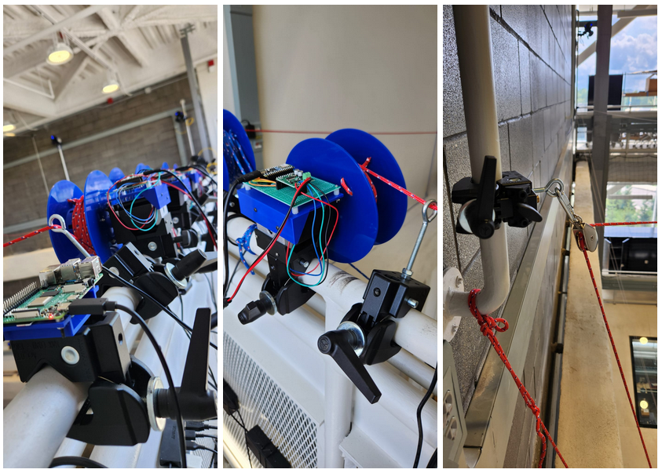

Fifteen VICON motion capture cameras spaced across a three-story indoor flight space required an accurate calibration system. Usually, for an accessible one-story space, a person waves around the calibration wand in irregular pattern covering the volume of the flight space as much as possible. The calibration wand consists of IR sensors uniquely spaced forming a T-shape. The motion capture cameras track these IR sensors as the wand is waved across the flight space. Once the cameras are calibrated, they are capable of returning the accurate position of the drone(s), thus aiding in drone localization and distributed control of aerospace systems.
<!--  -->

My contributions to calibrating the three-story indoor flight space are as follows,
- **Automated Calibration System**: Proposed a low-cost and easily controllable automated calibration system leveraging compound pulley mechanism to control the motion of the calibration wand with minimal changes to the laboratory infrastructure, while accounting for the physical limitations of the flight space.
- **Design and Fabrication**: Designed motor mounts, motor-to-pulley couplers, and PCB board mounts. Selected and procured motors and embedded components for the automation system.
- **Software Development**: Developed software in embedded C and Python for controlling the wand motion and accessing the entire flight space.
- **Non-linear Optimization**: Determined the optimal location of the pulleys and estimated their locations via non-linear optimization techniques, as they were outside the field of view of the cameras.
- **Experimentation**: Conducted experiments to determine the optimal wand waving pattern, reducing the collective reprojection error of the cameras.
 
<!-- ### Custom-designed parts -->
<!-- 
<model-viewer src="path/to/your/model.glb" alt="3D model" auto-rotate camera-controls></model-viewer> -->

### Hardware

The underlying necessity of the problem was to access every nook and corner of the flight space usin the calibartion wand. The proposed low-cost, easily controllable solution was to introduce _n_ pulleys for _n_ corners of the flight space from the ceiling, so that by adjusting the length of the rope, the calibration wand could cover the entire volume of the flight space. Clamps were used on the vertical and horizontal bars closer to the ceiling to mount the stepper motors and pulleys, providing easy access for maintenance and visual supervision during testing. Eyebolts were used to direct the ropes to the corners of the flight space, with all the ropes coming together to control the wand motion.

### Embedded system
Every motor is controlled by an Arduino through a motor driver, and all the Arduinos are controlled by a master Raspberry Pi. During experimentation, the optimal pattern to wave the calibration wand was identified and fed as 3D waypoints to the Raspberry Pi. Allowing for hard-coding the starting location, the Raspberry Pi controls individual Arduinos to reach the desired waypoints.

### Demo


VICON cameras tracking the calibration wand along the centre and corners of the flight space while displaying the reconstruction position in real-time along X, Y and Z axes 


A short clip of the pulleys controlling the calibration wand at 7 meters height along the corner of the indoor flight space

<!-- #### Photo Gallery
 -->