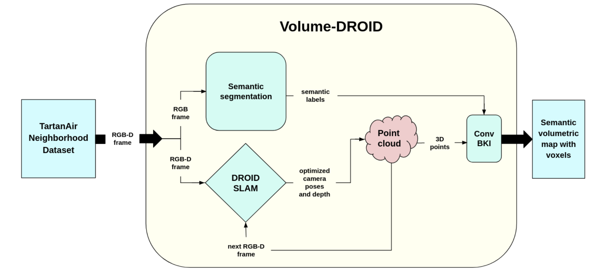

Volume-DROID is a novel SLAM architecture created by combining the recent works: [DROID-SLAM](https://arxiv.org/abs/2108.10869) and [NeuralBKI](https://arxiv.org/abs/2209.10663). Volume-DROID takes camera images (monocular or stereo) or frames from video as input and outputs online, 3D semantic mapping of the environment via combination of DROID-SLAM, point cloud registration, off-the-shelf semantic segmentation and ConvBKI. The novelty of our method lies in the fusion of DROID-SLAM and ConvBKI by the introduction of point cloud generation from RGB-Depth frames and optimized camera poses. By having only camera images or a stereo video as input, we achieved functional real-time online 3D semantic mapping.

### Process Overview
The process for Volume-DROID begins with utilizing the TartanAir neighborhood dataset, a virtual environment created in Unreal Engine, which eliminates the need to collect data for creating a custom environment. Images or frames of the environment are then input to DROID-SLAM to generate optimized camera poses. The optimized camera poses are used to generate a point cloud, with each pose stored as a 3D point. Subsequent images or frames are processed through DROID-SLAM to update the point cloud. Finally, the collection of 3D poses is passed to ConvBKI, which converts them into a semantic volumetric map of the environment using voxels.

### Implementation
To evaluate our algorithm, we ran inference on the neighborhood section of the the [TartanAir dataset](https://arxiv.org/abs/2003.14338). The TartanAir dataset contains photo-realistic simulation environments in the presence of various light conditions, weather and dynamic objects. DROID-SLAM is trained and evaluated on multiple environments within the TartanAir dataset. However, NeuralBKI was trained and evaluated on the [KITTI dataset](https://arxiv.org/abs/1904.01416) to leverage pre-existing models and avoid training from scratch, we evaluated Volume-DROID using the neighborhood subset of the TartanAir dataset. This subset was selected because it exhibits a higher degree of overlapping class labels with the KITTI dataset, compared to other subsets within TartanAir. By using the pretrained DROID-SLAM and NeuralBKI models, trained on the TartanAir and KITTI datasets respectively, we were able to effectively execute Volume-DROID. The publication is available [here](https://www.oajaiml.com/uploads/archivepdf/85361173.pdf)