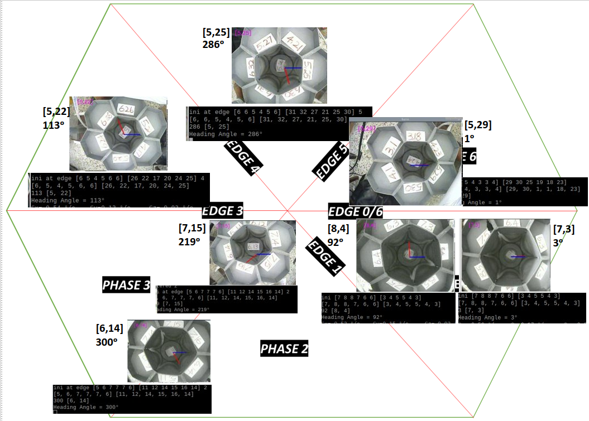

<!-- {}
Click the *Cite* button above to demo the feature to enable visitors to import publication metadata into their reference management software.
{}

{}
Create your slides in Markdown - click the *Slides* button to check out the example.
{}

Add the publication's **full text** or **supplementary notes** here. You can use rich formatting such as including [code, math, and images](https://docs.hugoblox.com/content/writing-markdown-latex/). -->

### Result
